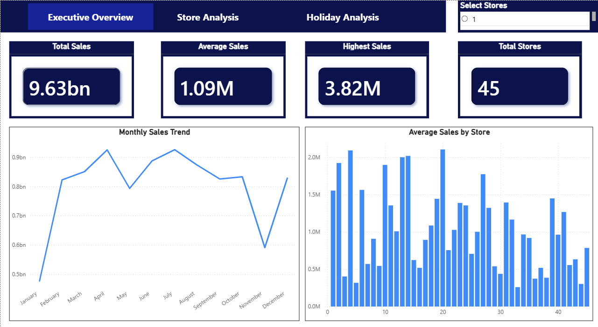
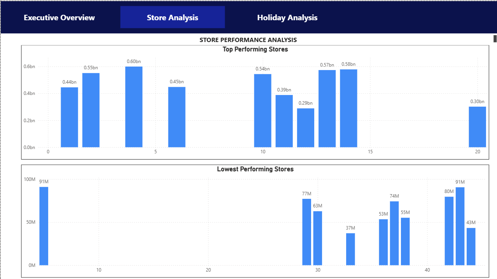
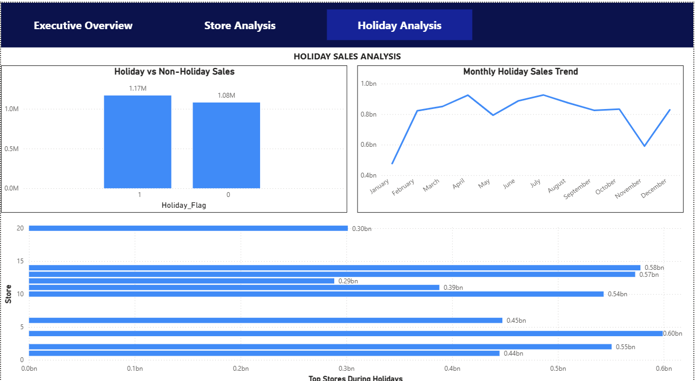

# walmart-sales-analytics-dashboard
 End-to-end Walmart Sales Analytics Dashboard project using Excel, MySQL, and Power BI. This project includes data cleaning, SQL-based business analysis, interactive dashboard development, sales trend analysis, store performance evaluation, and holiday sales impact insights.
 
## Project Overview

This project focuses on analyzing Walmart sales data using Excel, SQL, and Power BI.

The project includes:
- Data cleaning
- SQL-based business analysis
- Interactive Power BI dashboard
- Sales trend analysis
- Store performance analysis
- Holiday impact analysis

The goal of this project is to generate business insights and create an interactive analytics dashboard.

## Tools Used

- Excel
- MySQL
- Power BI

## Project Workflow

1. Data Cleaning using Excel
2. Data Import into MySQL
3. SQL Analysis & Business Queries
4. Dashboard Development in Power BI
5. Interactive Visualization & Insights

## SQL Analysis

- Total Sales Analysis
- Average Sales Analysis
- Top Performing Stores
- Lowest Performing Stores
- Holiday vs Non-Holiday Sales
- Monthly Sales Trends

## Dashboard Features

### Executive Overview
- KPI Cards
- Monthly Sales Trend
- Average Sales by Store

### Store Analysis
- Top Performing Stores
- Lowest Performing Stores

### Holiday Analysis
- Holiday Sales Comparison
- Monthly Holiday Trends
- Top Holiday Stores

## Key Insights

- Holiday weeks generated higher average sales than non-holiday weeks.
- Store 20, Store 4, and Store 14 were top-performing stores.
- Certain stores showed consistently low sales performance.
- Mid-year months generated higher sales trends.

## Dashboard Screenshots

### Executive Overview

### Store Analysis

### Holiday Analysis

## Author

Nitin Raj
B.Tech CSE Student
Aspiring Data Analyst
